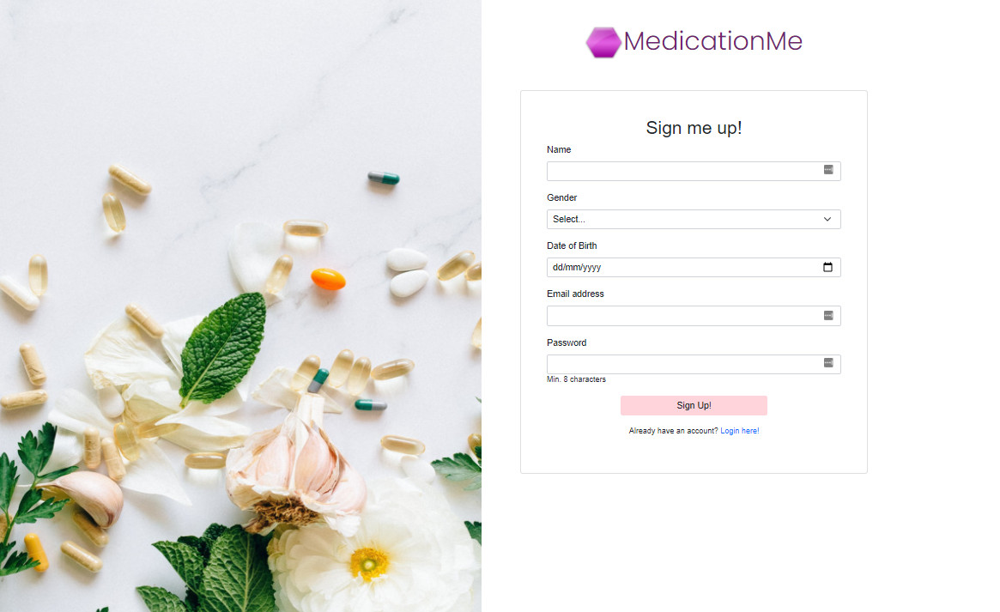

# MedicationMe

## Contributors

- Amelia Hooper: https://github.com/ahooper00
- Anna Nguyen: https://github.com/AnnaNguyen1
- Sam Hong: https://github.com/s-hong0125

## User Story

As a user,
I want to record all the medications I require,
So I know when and how much to take each medication each day.

## Description

MedicationMe is an application that allows users to create their own account, and record all the medications they need to take and for how long. Users will be able to record the name of the medication, time they need to take it, how long they need to take it for, their dosage and any further instructions required. They will be greeted with the medications for the day, and any meds upcoming.

## Technologies

- Handlebars (HTML & CSS)
- Javascript
- Node.js
- Express.js
- Nodemon
- NPM dependencies

## Installation

Installation of Node.js on your local machine is required to properly use this application.

- Clone the repository to your local diretory.

- git clone https://github.com/ahooper00/MedicationMe.git.

- Install the necessary packages in this application by running the command "npm install package-name" if the packages are not included in your Node Moudles folder.

- Run "mysql -u root -p" with the correct username & password in .env file then run the command "source db/schema.sql" to connect the database.

- Run "node server.js" or "npm start" in order to connect to the server.

## Usage

## Links

## Preview

The following images demonstrates the UI of the application:

## Resources

- Google
- Learning materials class
- Youtube
- Class Instructor and T.A's
